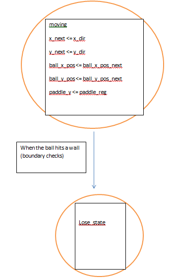

#Lab2
====

##Pong in VHDL  
This lab expands upon the project in Lab1 that displays a test screen onto a monitor,
except that this lab implements a simple game of pong using VHDL.
r
#Implementation

- As the same in Lab 1, this lab used D flip flops for states (current and next) as well as for the buffers.
  - The most significant use of this is in the Pong Control module where it was necessary to keep track of
    and implement the different states.
  - Example of a Flip Flop in VHDL
``` VHDL
-- state register
	process(clk, reset)
	begin
		if (reset = '1') then
			state <= idle;
		elsif(rising_edge(clk)) then
			state <= state_next;
		end if;
	end process;
```

- Pong_Control



# `atlys_lab_video`
The top level module. This instantias vga_sync and pixel_gen and the new Pong Control.

# `vga_sync`
This connects v_sync and h_sync. It instantiates both of them (same as Lab 1)

# `v_sync_gen`
This generates the vertical signals. It cycles throught the 5 states that are in the state diagram. It uses three flip flops for next state logic, count logic and reset logic.
Same as Lab 1.

# `h_sync_gen`
This generates the horizontal signals. It cycles throught the 5 states that are in the state diagram. It uses three flip flops for next state logic, count logic and reset logic.
Same as Lab 1.

# `pixel_gen`
This assigns RGB to different values to display different colors. The higher the value, the higher the intensity.
Same as Lab 1 except for the fact that it no longer displays a test screen but has been changed to accomodate a pong game instead.

# `Pong_control`
This handles all of the movement of the ball and the paddle. The paddle is moved vertically with the buttons. It instantiates an up and a down button wherin one moves the paddle up and one moves it down. The rest of the module is for the movement of the ball. It keeps track of and changes the direction of the ball through boundary checking at every position.

# Testing and Debugging
- The typical method of coding everything and waiting until the last minute provided to be problematic again. Should have learned from the first time.
- The biggest problem I found was wiring everything up correctly in Xilinx. I got lost in the different names and sometimes confused them for another.

# Conclusion
- I have to be extremely careful with instantiating and virtually wiring up everything in the top levels. I learned that there are many, many ways you can build state machines to solve the same problem. One can use a lot of little states or one can combine the little states into fewer bigger states with more variables used in them.

